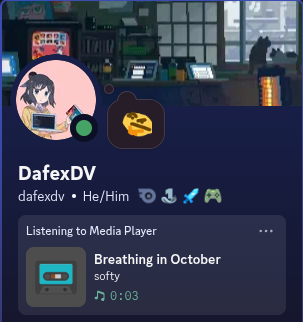

# Media Player Discord RPC


Script to send a Discord activity on your current playing media information.
Uses D-Bus to communicate with the Media Player to extract the data, then sends the current
media playing information as an activity.

## How to use

It's really easy to use. By default it comes with a default discord application id ready to use.

Just clone the repository, then install the system and python dependencies.

Execute the script and it's should be done.

### 1. System Dependencies

Fedora:

```bash
sudo dnf install dbus-devel glib2-devel python3-devel gcc pkgconf-pkg-config
```

Debian/Ubuntu:

```bash
sudo apt install libdbus-1-dev libglib2.0-dev python3-dev gcc pkg-config
```

### 2. Python Dependencies

```
pip3 install -r requirements.txt
```

### 3. Run the script

```bash
python3 mp_discord_rpc.py
```

## Discord Application

By default, the application id will be an application that I, dafexdv, created.

Therefore, by default, you are depending on my Discord account for the script to work.

Feel free to configure your own discord application and
passing its id to the script config file:

`~/.config/mp_discord_rpc/config.json`

## Attributions

- **[Papirus Icon Theme](https://github.com/PapirusDevelopmentTeam/papirus-icon-theme):** Base Asset Icons

For more info: [ATTRIBUTIONS.md](./ATTRIBUTIONS.md)
